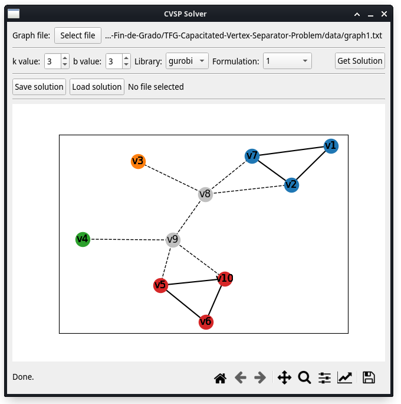

# Capacitated Vertex Separation Problem solver

This program calculates the optimal solution to the Capacitated Vertex Separator Problem (CVSP) on a graph through various
 formulations using integer optimization approaches.


## Getting Started

This is an example of how you may give instructions on setting up your project locally.
To get a local copy up and running follow these simple example steps.


### Installation

1. Clone this repo:
   ```sh
   git clone https://github.com/alu0101124896/TFG-CVSP-solver.git cvsp_solver
   ```
   Note: the name has been changed to be able to use it as a python package

2. Move to the repo's main folder:
   ```sh
   cd ./cvsp_solver
   ```

3. Install required packages:
   ```sh
   pip install -r ./requirements.txt
   ```


### Usage

For the execution of this program you have the following alternatives:

* GUI:
   ```sh
   python3 ./gui_main.py
   ```

   


* CLI:
   ```sh
   python3 ./cli_main.py
   ```

   This command can be optionally executed with any of the flags listed below:

   * `[--input-file | -i] INPUT_FILE`:

      Import graph's definition from INPUT_FILE.

   * `[--output-file | -o] OUTPUT_FILE`:

      Export the solution to OUTPUT_FILE.

   * `[--library-name | -l] LIBRARY_NAME`:

      Select an optimization library to use:
      * For Google OR-Tools library: 'ortools'
      * For Gurobi Optimization library: 'gurobi'

   * `[--formulation-index | -f] FORMULATION_INDEX`:

      Select a problem formulation to use:
      * For Google OR-Tools library: [1-4]
      * For Gurobi Optimization library: [1-8]

   * `[--k-value | -k] K_VALUE`:

      Minimum number of remaining shores.

   * `[--b-value | -b] B_VALUE`:

      Maximum number of nodes on the remaining shores.

   * `[--no-gui | -g]`:

      Do NOT output the solution graphically.

   * `[--quiet | -q]`:

      Suppress all normal cli output.

   If none of the previous arguments is introduced, the program will ask for them interactively, except if the "quiet" flag is active, which will make the program to use the default values on those that aren't provided.


* Import as a package:
   ```py
   from cvsp_solver import solve_cvsp

   solve_cvsp(
       input_file="./cvsp_solver/data/graph1.txt",
       output_file="./graph1-solution.txt",
       library_name="gurobi",
       formulation_index=1,
       k_value=3,
       b_value=3,
       no_gui=True,
       quiet=True,
   )
   ```

## License

This work is licensed under a
[Creative Commons Attribution-ShareAlike 4.0 International License][cc-by-sa].

[![CC BY-SA 4.0][cc-by-sa-image]][cc-by-sa]

[cc-by-sa]: http://creativecommons.org/licenses/by-sa/4.0/
[cc-by-sa-image]: https://licensebuttons.net/l/by-sa/4.0/88x31.png
